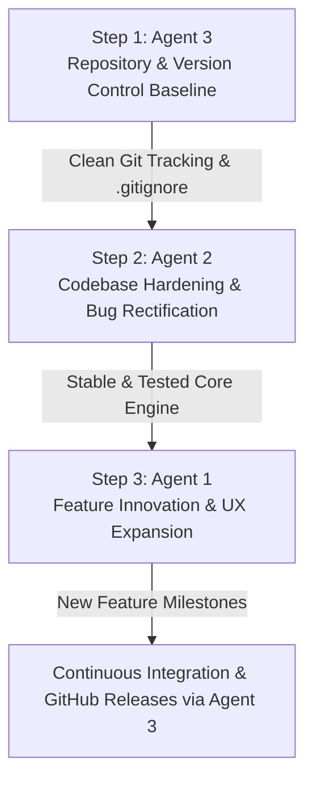

# DESKTOP VISTA — AGENT INITIATIVE SUITE

This directory contains three comprehensive, actionable task prompts prepared for the specialized teams and agents contributing to the **Desktop Vista** desktop wallpaper manager initiative.

---

## Agent Suite Overview

| Agent Document | Assigned Specialty | Primary Objective |
| :--- | :--- | :--- |
| **[AGENT_1_FEATURE_INNOVATION.md](file:///D:/Desktop_Vista/AGENT_1_FEATURE_INNOVATION.md)** | **Product Architect & UX Innovation Specialist** | Exploration of cutting-edge functionality, multi-drive virtual libraries, multi-monitor (`IDesktopWallpaper`) support, system tray automation (`pystray`), day/night dynamic wallpapers, and modern UI polish. |
| **[AGENT_2_CODEBASE_HARDENING.md](file:///D:/Desktop_Vista/AGENT_2_CODEBASE_HARDENING.md)** | **Lead Codebase Auditor & QA Systems Engineer** | In-depth codebase audit of `desktop_vista.py`, fixing synchronous navigation I/O, background worker image decoding, WebP Windows API compatibility, timer race conditions, and unit testing. |
| **[AGENT_3_GITHUB_MANAGEMENT.md](file:///D:/Desktop_Vista/AGENT_3_GITHUB_MANAGEMENT.md)** | **DevOps & Version Control Release Specialist** | Seamless alignment between local folder `D:\Desktop_Vista` and GitHub repository `https://github.com/hawkers63/Desktop-Vista`, `.gitignore`, `config.example.json`, professional `README.md`, and strict proprietary copyright enforcement. |

---

## Recommended Execution Workflow

1. **Step 1 — Establish Repository Baseline (Agent 3)**:
   Initialize the local Git repository, reconcile with GitHub (`https://github.com/hawkers63/Desktop-Vista`), set up `.gitignore` and `config.example.json`, and commit the proprietary copyright notice and initial documentation.
2. **Step 2 — Codebase Hardening & Bug Fixing (Agent 2)**:
   Rectify known edge cases and performance bottlenecks in `desktop_vista.py` (decoupling disk saves, threaded decoding, WebP caching, timer reset logic), ensuring a rock-solid, unit-tested v1.0 foundation.
3. **Step 3 — Feature Innovation & UX Enhancement (Agent 1)**:
   Design and implement v1.1 and v2.0 features (system tray daemon, multi-monitor display routing, cross-drive playlists, smart solar scheduling).

---

## Quick Reference Links

- **Main Application**: [`desktop_vista.py`](file:///D:/Desktop_Vista/desktop_vista.py)
- **Local Configuration**: [`config.json`](file:///D:/Desktop_Vista/config.json)
- **Design & Scope Notes**: [`notes/notes_001.txt`](file:///D:/Desktop_Vista/notes/notes_001.txt)
- **Remote GitHub Repository**: [hawkers63/Desktop-Vista](https://github.com/hawkers63/Desktop-Vista)
