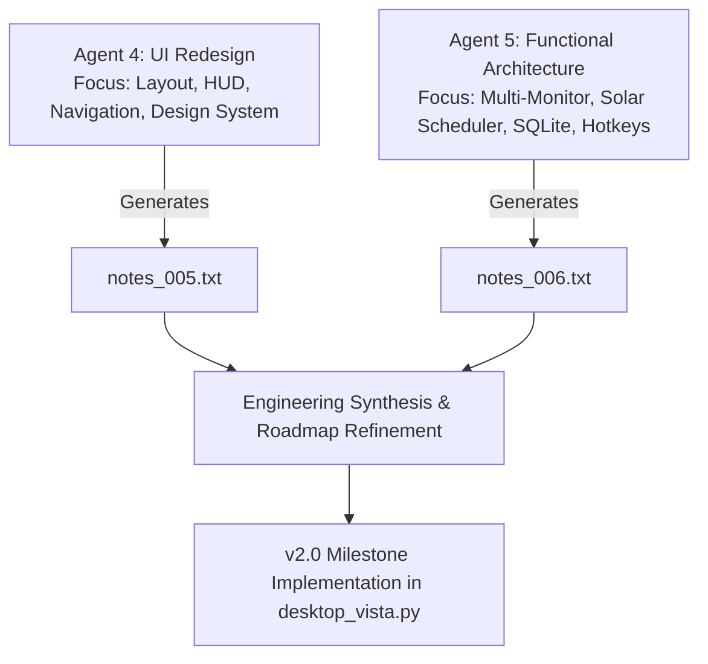

# DESKTOP VISTA — AGENT INITIATIVE SUITE

This directory contains comprehensive, actionable task prompts prepared for the specialized agents and engineering teams contributing to the **Desktop Vista** Windows wallpaper manager initiative.

All agents must follow the repository convention of recording their deliverables and technical outputs directly into sequential notes packs within [`D:\Desktop_Vista\notes\`](file:///D:/Desktop_Vista/notes/) using the format `notes_[N].txt`.

---

## Complete Agent Suite Overview

| Agent Document | Specialty Role | Target Output File | Core Focus & Mission |
| :--- | :--- | :--- | :--- |
| **[`AGENT.md`](file:///D:/Desktop_Vista/agents/AGENT.md)** | **Master Autonomous Systems Architect & Lead Engineer** | Unified / Any Target | Consolidates and optimizes all 5 agent roles into a single, unified specification with multi-mode execution and safety guardrails. |
| **[`agents/AGENT_1_FEATURE_INNOVATION.md`](file:///D:/Desktop_Vista/agents/AGENT_1_FEATURE_INNOVATION.md)** | **Product Architect & UX Innovation Specialist** | [`notes/notes_002.txt`](file:///D:/Desktop_Vista/notes/notes_002.txt) | Exploration of baseline features, playlists, system tray automation (`pystray`), day/night scheduling, and foundational roadmap (v1.1 → v2.0). |
| **[`AGENT_2_CODEBASE_HARDENING.md`](file:///D:/Desktop_Vista/agents/AGENT_2_CODEBASE_HARDENING.md)** | **Lead Codebase Auditor & QA Systems Engineer** | [`notes/notes_003.txt`](file:///D:/Desktop_Vista/notes/notes_003.txt) | In-depth audit of `desktop_vista.py`, fixing synchronous navigation I/O, background threaded decoding, WebP transcode cache, timer lifecycle, and test coverage. |
| **[`AGENT_3_GITHUB_MANAGEMENT.md`](file:///D:/Desktop_Vista/agents/AGENT_3_GITHUB_MANAGEMENT.md)** | **DevOps & Version Control Release Specialist** | GitHub Remote / `README.md` / `LICENSE` | Clean Git initialization, remote reconciliation with [`hawkers63/Desktop-Vista`](https://github.com/hawkers63/Desktop-Vista), `.gitignore`, and strict proprietary copyright enforcement. |
| **[`agents/AGENT_4_UI_IMPROVEMENTS.md`](file:///D:/Desktop_Vista/agents/AGENT_4_UI_IMPROVEMENTS.md)** | **Lead UI/UX Designer & Interface Architect** | **[`notes/notes_005.txt`](file:///D:/Desktop_Vista/notes/notes_005.txt)** | Ergonomic overhaul of the v1.5.1 interface: decomposing the 11-section sidebar into segmented tabs/accordions, replacing 3 button rows with a floating preview HUD, interactive monitor topology card selector, tag chips, and native toast notifications. |
| **[`agents/AGENT_5_FUNCTIONAL_ENHANCEMENTS.md`](file:///D:/Desktop_Vista/agents/AGENT_5_FUNCTIONAL_ENHANCEMENTS.md)** | **Principal Systems Architect & Automation Strategist** | **[`notes/notes_006.txt`](file:///D:/Desktop_Vista/notes/notes_006.txt)** | Next-generation systems architecture: independent per-monitor playback state engines, ultrawide/span image slicing, live astronomical solar scheduling, system-wide global hotkeys (`RegisterHotKey`), lock screen sync, and SQLite catalog migration. |


---

## Sequential Deliverables Index (`D:\Desktop_Vista\notes\`)

The project maintains an unbroken chronological record of research, audits, and architectural specifications:

```
D:\Desktop_Vista\notes\
├── notes_001.txt   # Initial Concept, Scope & UI Layout Intent
├── notes_002.txt   # Feature Backlog & Phased Roadmap v1.1 → v2.0 (Agent 1 deliverable)
├── notes_003.txt   # v1.1 Codebase Hardening, Reliability & Security Audit (Agent 2 deliverable)
├── notes_004.txt   # v1.2 Architecture/UX Review, Brand Icon Integration & v1.2.1 Patch Plan
├── notes_005.txt   # UI Improvements & Visual Experience Overhaul (Agent 4 deliverable)
└── notes_006.txt   # Functional Enhancements & Advanced Systems Architecture (Agent 5 deliverable)
```

---

## Recommended Multi-Agent Workflow



1. **Step 1 — UI Evolution (Agent 4)**:
   Deploy Agent 4 to evaluate the v1.5.1 interface and output [`notes_005.txt`](file:///D:/Desktop_Vista/notes/notes_005.txt). This solves the vertical screen crowding and visual hierarchy problems before adding more controls.
2. **Step 2 — Functional Architecture (Agent 5)**:
   Deploy Agent 5 to architect the independent per-monitor state machine, solar scheduler, and SQLite backend, outputting [`notes_006.txt`](file:///D:/Desktop_Vista/notes/notes_006.txt).
3. **Step 3 — Integration & Implementation**:
   Merge the visual HUD patterns from `notes_005.txt` with the multi-monitor engine from `notes_006.txt` into the production v2.0 codebase.

---

## Quick Reference Links

- **Master Agent Specification**: [`AGENT.md`](file:///D:/Desktop_Vista/agents/AGENT.md)
- **SuperGrok Configuration Guide**: [`GROK_SETTINGS.md`](file:///D:/Desktop_Vista/agents/GROK_SETTINGS.md)
- **Main Application**: [`desktop_vista.py`](file:///D:/Desktop_Vista/desktop_vista.py)
- **COM Display Engine**: [`windows_wallpaper_com.py`](file:///D:/Desktop_Vista/windows_wallpaper_com.py)
- **Configuration Template**: [`config.example.json`](file:///D:/Desktop_Vista/config.example.json)
- **Project Continuity Memory**: [`MEMORY.md`](file:///D:/Desktop_Vista/MEMORY.md)
- **Release Roadmap**: [`ROADMAP.md`](file:///D:/Desktop_Vista/ROADMAP.md)
- **Remote GitHub Repository**: [hawkers63/Desktop-Vista](https://github.com/hawkers63/Desktop-Vista)

